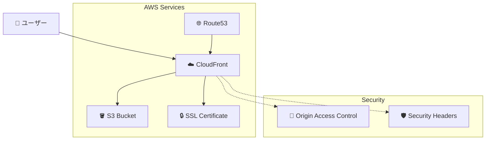

# 🚀 Simple Task Tracker - AWS デプロイガイド

このドキュメントでは、Simple Task TrackerをAWSにデプロイする手順を説明します。

## 📋 目次

- [アーキテクチャ概要](#アーキテクチャ概要)
- [前提条件](#前提条件)
- [クイックスタート](#クイックスタート)
- [詳細デプロイ手順](#詳細デプロイ手順)
- [カスタムドメイン設定](#カスタムドメイン設定)
- [環境別デプロイ](#環境別デプロイ)
- [運用・保守](#運用保守)
- [トラブルシューティング](#トラブルシューティング)

## 🏗️ アーキテクチャ概要



### 主要コンポーネント

| サービス | 役割 | 特徴 |
|----------|------|------|
| **S3** | 静的ファイルホスティング | 高可用性、低コスト |
| **CloudFront** | CDN、SSL終端 | 高速配信、グローバル展開 |
| **ACM** | SSL証明書管理 | 自動更新、無料 |
| **Route53** | DNS管理 | 高可用性DNS |
| **OAC** | アクセス制御 | セキュアなS3アクセス |

## ✅ 前提条件

### 必要なツール

```bash
# Node.js (v16以上)
node --version

# AWS CLI
aws --version

# Git
git --version
```

### AWS設定

```bash
# AWS認証情報設定
aws configure

# 設定確認
aws sts get-caller-identity
```

### 必要な権限

デプロイに必要なIAM権限：

```json
{
  "Version": "2012-10-17",
  "Statement": [
    {
      "Effect": "Allow",
      "Action": [
        "s3:*",
        "cloudfront:*",
        "acm:*",
        "route53:*",
        "cloudformation:*",
        "iam:*"
      ],
      "Resource": "*"
    }
  ]
}
```

## 🚀 クイックスタート

### 1. 自動デプロイスクリプト使用

```bash
# 基本デプロイ
./deploy-aws.sh

# ヘルプ表示
./deploy-aws.sh --help
```

### 2. 手動デプロイ

```bash
# CDKディレクトリに移動
cd cdk

# 依存関係インストール
npm install

# ブートストラップ（初回のみ）
cdk bootstrap

# デプロイ
cdk deploy
```

## 📝 詳細デプロイ手順

### Step 1: プロジェクト準備

```bash
# プロジェクトクローン
git clone <repository-url>
cd simple-task-tracker

# ファイル確認
ls -la simple-task-tracker-standalone.html
```

### Step 2: AWS環境準備

```bash
# AWSアカウント確認
aws sts get-caller-identity

# リージョン設定
export AWS_DEFAULT_REGION=ap-northeast-1
```

### Step 3: CDK環境セットアップ

```bash
cd cdk

# 依存関係インストール
npm install

# TypeScriptコンパイル
npm run build

# テスト実行（オプション）
npm test
```

### Step 4: CDKブートストラップ

```bash
# ブートストラップ実行
cdk bootstrap

# 確認
aws cloudformation list-stacks --query 'StackSummaries[?StackName==`CDKToolkit`]'
```

### Step 5: デプロイ実行

```bash
# 差分確認
cdk diff

# デプロイ実行
cdk deploy

# 自動承認
cdk deploy --require-approval never
```

### Step 6: デプロイ確認

```bash
# スタック確認
aws cloudformation describe-stacks --stack-name SimpleTaskTrackerStack

# 出力値取得
aws cloudformation describe-stacks \
  --stack-name SimpleTaskTrackerStack \
  --query 'Stacks[0].Outputs'
```

## 🌐 カスタムドメイン設定

### 前提条件

- Route53でドメインを管理していること
- ホストゾーンIDを把握していること

### デプロイ手順

```bash
# 環境変数設定
export DOMAIN_NAME="task-tracker.example.com"
export HOSTED_ZONE_ID="Z1234567890ABC"

# カスタムドメインでデプロイ
./deploy-aws.sh -d $DOMAIN_NAME -z $HOSTED_ZONE_ID
```

### 手動設定

```bash
cd cdk

# コンテキスト変数でデプロイ
cdk deploy \
  -c domainName=task-tracker.example.com \
  -c hostedZoneId=Z1234567890ABC
```

### DNS設定確認

```bash
# DNS伝播確認
nslookup task-tracker.example.com

# SSL証明書確認
curl -I https://task-tracker.example.com
```

## 🏷️ 環境別デプロイ

### 開発環境

```bash
# 開発環境デプロイ
./deploy-aws.sh -e dev

# または
cd cdk && cdk deploy -c environment=dev
```

### ステージング環境

```bash
# ステージング環境デプロイ
./deploy-aws.sh -e staging

# カスタムドメイン付き
./deploy-aws.sh -e staging -d staging.task-tracker.example.com
```

### 本番環境

```bash
# 本番環境デプロイ（デフォルト）
./deploy-aws.sh -e production

# 本番環境の特徴
# - バージョニング有効
# - ログ有効
# - 削除保護有効
```

### 環境別設定

| 環境 | バージョニング | ログ | 削除保護 | 価格クラス |
|------|---------------|------|----------|------------|
| dev | ❌ | ❌ | ❌ | 100 |
| staging | ❌ | ❌ | ❌ | 100 |
| production | ✅ | ✅ | ✅ | 100 |

## 🔧 運用・保守

### 更新デプロイ

```bash
# ファイル更新後
./deploy-aws.sh

# キャッシュクリア付き
aws cloudfront create-invalidation \
  --distribution-id E1234567890ABC \
  --paths "/*"
```

### 監視設定

```bash
# CloudWatchメトリクス確認
aws cloudwatch get-metric-statistics \
  --namespace AWS/CloudFront \
  --metric-name Requests \
  --dimensions Name=DistributionId,Value=E1234567890ABC \
  --start-time 2024-01-01T00:00:00Z \
  --end-time 2024-01-02T00:00:00Z \
  --period 3600 \
  --statistics Sum
```

### バックアップ

```bash
# S3バケット同期
aws s3 sync s3://your-bucket-name ./backup/

# CloudFormationテンプレート保存
aws cloudformation get-template \
  --stack-name SimpleTaskTrackerStack \
  > backup/template.json
```

### コスト監視

```bash
# 月間コスト確認
aws ce get-cost-and-usage \
  --time-period Start=2024-01-01,End=2024-02-01 \
  --granularity MONTHLY \
  --metrics BlendedCost \
  --group-by Type=DIMENSION,Key=SERVICE
```

## 🗑️ リソース削除

### 完全削除

```bash
# スタック削除
./deploy-aws.sh --destroy

# または
cd cdk && cdk destroy
```

### 段階的削除

```bash
# 1. CloudFrontディストリビューション無効化
aws cloudfront get-distribution-config --id E1234567890ABC
aws cloudfront update-distribution --id E1234567890ABC --distribution-config file://config.json

# 2. S3バケット空にする
aws s3 rm s3://bucket-name --recursive

# 3. スタック削除
cdk destroy
```

## 🚨 トラブルシューティング

### よくある問題

#### 1. デプロイエラー

```bash
# エラー: "CDK not bootstrapped"
cdk bootstrap

# エラー: "Insufficient permissions"
aws sts get-caller-identity
aws iam get-user
```

#### 2. ドメイン設定エラー

```bash
# DNS設定確認
dig task-tracker.example.com

# Route53設定確認
aws route53 list-hosted-zones
aws route53 list-resource-record-sets --hosted-zone-id Z1234567890ABC
```

#### 3. SSL証明書エラー

```bash
# 証明書状態確認
aws acm list-certificates --region us-east-1
aws acm describe-certificate --certificate-arn arn:aws:acm:...
```

#### 4. CloudFront配布エラー

```bash
# ディストリビューション状態確認
aws cloudfront get-distribution --id E1234567890ABC

# キャッシュ無効化
aws cloudfront create-invalidation \
  --distribution-id E1234567890ABC \
  --paths "/*"
```

### ログ確認

```bash
# CloudFormationイベント
aws cloudformation describe-stack-events \
  --stack-name SimpleTaskTrackerStack

# CloudTrail（API呼び出し履歴）
aws logs describe-log-groups
aws logs get-log-events --log-group-name /aws/cloudtrail
```

### デバッグモード

```bash
# CDKデバッグ出力
cdk deploy --verbose

# CloudFormationテンプレート確認
cdk synth > template.yaml
```

## 📊 パフォーマンス最適化

### キャッシュ設定

```bash
# キャッシュヒット率確認
aws cloudwatch get-metric-statistics \
  --namespace AWS/CloudFront \
  --metric-name CacheHitRate \
  --dimensions Name=DistributionId,Value=E1234567890ABC
```

### 圧縮設定

- Gzip圧縮: 自動有効
- Brotli圧縮: CloudFrontで自動

### CDN最適化

- 価格クラス: PriceClass_100（北米・ヨーロッパ）
- HTTP/3サポート: 有効
- セキュリティヘッダー: 自動追加

## 🔒 セキュリティ

### 実装済み対策

- ✅ HTTPS強制リダイレクト
- ✅ Origin Access Control (OAC)
- ✅ セキュリティヘッダー自動追加
- ✅ S3パブリックアクセス無効
- ✅ SSL/TLS 1.2以上強制

### 追加推奨設定

```bash
# WAF設定（オプション）
aws wafv2 create-web-acl \
  --name SimpleTaskTrackerWAF \
  --scope CLOUDFRONT

# Shield Advanced（オプション）
aws shield subscribe-to-proactive-engagement
```

## 📞 サポート

### 問題報告時の情報

- AWSアカウントID
- リージョン
- CDKバージョン
- エラーメッセージ
- 実行したコマンド

### 参考資料

- [AWS CDK Documentation](https://docs.aws.amazon.com/cdk/)
- [CloudFront Developer Guide](https://docs.aws.amazon.com/cloudfront/)
- [S3 Static Website Hosting](https://docs.aws.amazon.com/s3/latest/userguide/WebsiteHosting.html)

---

**Simple Task Tracker** - シンプルで効率的なタスク管理をクラウドで 🚀